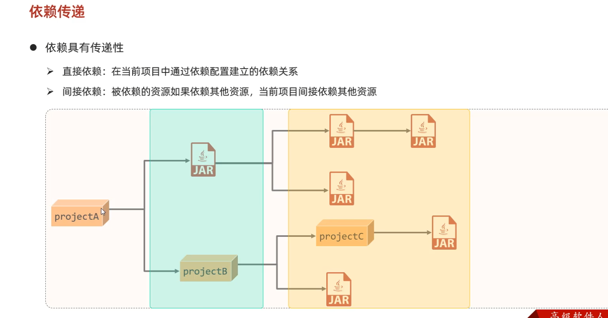
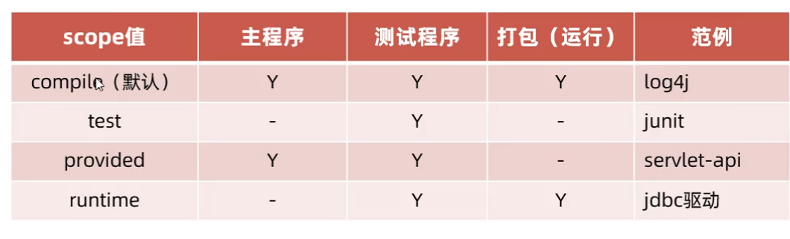

# 1. Maven作用
## 1.1. 依赖管理： 管理项目依赖的资源 - jar包（避免版本冲突）
在pom.xml文件中配置依赖 - 可以修改版本， maven将自动联网下载
```
<dependency>
    <groupId>org.controlsfx</groupId>
    <artifactId>controlsfx</artifactId>
    <version>11.1.1</version>
</dependency>
```
## 1.2. 统一项目结构
```
src
  main        项目实际资源
    java      Java源代码
    resource  资源文件
  test        项目测试资源
    java
    resource
  pom.xml     项目配置文件
```
## 1.3. 项目构建 ( .java ---> .classes )
1. 编译：maven -> 生命周期 -> compile =>> 生成(target/classes文件) 存放编译后的文件
2. 测试：maven -> 生命周期 -> test
3. 打包：maven -> 生命周期 -> package =>> 生成target文件
4. 发布：maven -> 生命周期 -> 

# 2. Maven仓库 （存储各种jar包）
1. 本地仓库： 自己计算机上
2. 中央仓库： Maven团队维护的，全球唯一的
3. 远程仓库： 私服，公司团队搭建

# 3. 安装Maven
解压apache-maven-3.6.1
新建本地仓库：mvn_repo
## 3.1 配置本地仓库
配置本地路径：conf/setting.xml下，
```
  <localRepository>D:\javaWeb\apache-maven-3.6.1\mvn_repo</localRepository>
```

## 3.2 配置阿里云私服
```
     <mirror>
          <id>alimaven</id>
          <name>aliyun maven</name>
          <url>http://maven.aliyun.com/nexus/content/groups/public/</url>
          <mirrorOf>central</mirrorOf>
      </mirror>
```

## 3.3 配置环境变量
高级系统设置 =》 环境变量
 =》 添加变量值 MAVEN_HOME 及 地址D:\javaWeb\apache-maven-3.6.1
 =》 path 中添加 %MAVEN_HOME%\bin

## 3.4 测试是否成功
cmd -> mvn -v


# 4. 创建Maven
## 4.1 路径
文件 =》 设置 =》 构建 =》 构建工具 =》 Maven
=》 Maven主路径 =》 ··· =》 D:\javaWeb\apache-maven-3.6.1
=》 用户设置文件 =》重写 conf -> settings.xml
=》 本地仓库 =》 重写 mvn_repo

## 4.2 Maven坐标
组织名：groupId     - com.hower
模块名：artifactId  - maven_demo1
版本号： version    - 1.0-SNAPSHOT


# 5. 导入Maven
## 5.1 当前模块导入
点击模块 =》 右键打开于 =》 文件资源管理器
=》 复制要导入的整个项目 =》 右侧maven 
=> 点击 + 号 =》 找到需导入的文件的pom.xml

## 5.2 项目结构导入
文件 =》项目结构 =》 模块 =》 点击 + 号
=》 导入模块 =》 选择要导入的模块的pom.xml


# 6. 依赖管理
## 6.1 依赖配置
在pom.xml文件添加dependency
去maven仓库搜索要添加的依赖名字 =》 复制粘贴到pom.xml
=》点击刷新 =》 即可自动联网下载


## 6.2 依赖传递
### 6.2.1 查看依赖


打开pom.xml文件 =》 右键 =》 图表

### 6.2.2 排除依赖 - exclusion
在某个项目中， 不想要某个依赖， 防止传递
```
        <dependency>
          <exclusions>
            <exclusion>
                <groupId>junit</groupId>
                <artifactId>junit</artifactId>
                <version>4.12</version>
            </exclusion>
          </exclusions>
        </dependency>
```

## 6.3 依赖范围
jar包默认任何地方都可以使用
通过<scoped> ... </scoped>, 限制范围

compile:  全局有效 (默认的)
test:     只对test有效
provided: 打包无效
runtime:  主程序无效

## 6.4 生命周期
1. clean   清理： 移出上一次构建生成的文件
2. default 核心： 编译、测试、打包、安装、部署
          （ 运行后面的阶段后，前面的阶段都会运行）
3. site    生成报告、发布站点


