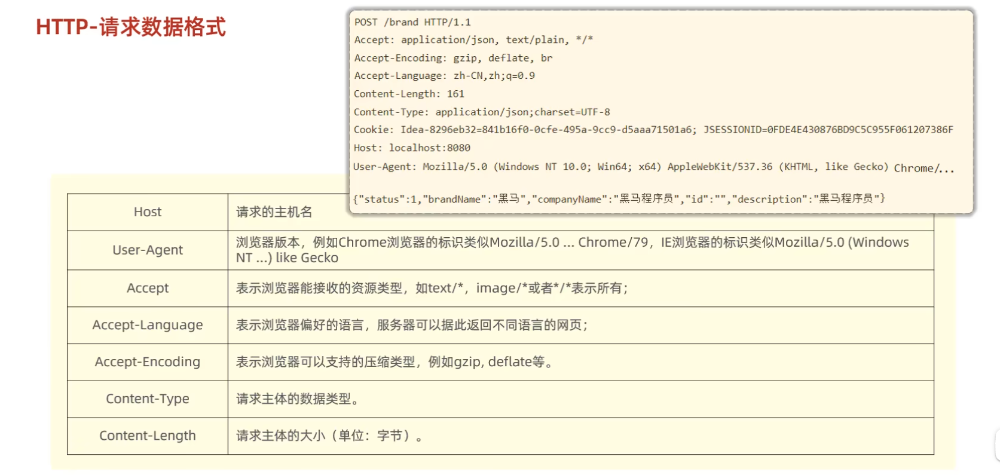

## 1. 请求数据格式

## 2. 响应状态码

### 一、状态码大类

| 状态码分类 | 说明                                                         |
| ---------- | ------------------------------------------------------------ |
| 1xx        | **响应中**——临时状态码，表示请求已经接受，告诉客户端应该继续请求或者如果它已经完成则忽略它 |
| 2xx        | **成功**——表示请求已经被成功接收，处理已完成                 |
| 3xx        | **重定向**——重定向到其它地方：它让客户端再发起一个请求以完成整个处理。 |
| 4xx        | **客户端错误**——处理发生错误，责任在客户端，如：客户端的请求一个不存在的资源，客户端未被授权，禁止访问等 |
| 5xx        | **服务器端错误**——处理发生错误，责任在服务端，如：服务端抛出异常，路由出错，HTTP版本不支持等 |

### 二、常见的响应状态码

| 状态码  | 英文描述                               | 解释                                                         |
| ------- | -------------------------------------- | ------------------------------------------------------------ |
| ==200== | **`OK`**                               | 客户端请求成功，即**处理成功**，这是我们最想看到的状态码     |
| 302     | **`Found`**                            | 指示所请求的资源已移动到由`Location`响应头给定的 URL，浏览器会自动重新访问到这个页面 |
| 304     | **`Not Modified`**                     | 告诉客户端，你请求的资源至上次取得后，服务端并未更改，你直接用你本地缓存吧。隐式重定向 |
| 400     | **`Bad Request`**                      | 客户端请求有**语法错误**，不能被服务器所理解                 |
| 403     | **`Forbidden`**                        | 服务器收到请求，但是**拒绝提供服务**，比如：没有权限访问相关资源 |
| ==404== | **`Not Found`**                        | **请求资源不存在**，一般是URL输入有误，或者网站资源被删除了  |
| 405     | **`Method Not Allowed`**               | 请求方式有误，比如应该用GET请求方式的资源，用了POST          |
| 428     | **`Precondition Required`**            | **服务器要求有条件的请求**，告诉客户端要想访问该资源，必须携带特定的请求头 |
| 429     | **`Too Many Requests`**                | 指示用户在给定时间内发送了**太多请求**（“限速”），配合 Retry-After(多长时间后可以请求)响应头一起使用 |
| 431     | **` Request Header Fields Too Large`** | **请求头太大**，服务器不愿意处理请求，因为它的头部字段太大。请求可以在减少请求头域的大小后重新提交。 |
| ==500== | **`Internal Server Error`**            | **服务器发生不可预期的错误**。服务器出异常了，赶紧看日志去吧 |
| 503     | **`Service Unavailable`**              | **服务器尚未准备好处理请求**，服务器刚刚启动，还未初始化好   |

状态码大全：https://cloud.tencent.com/developer/chapter/13553 

3. http协议解析
使用tomcat服务器解析

