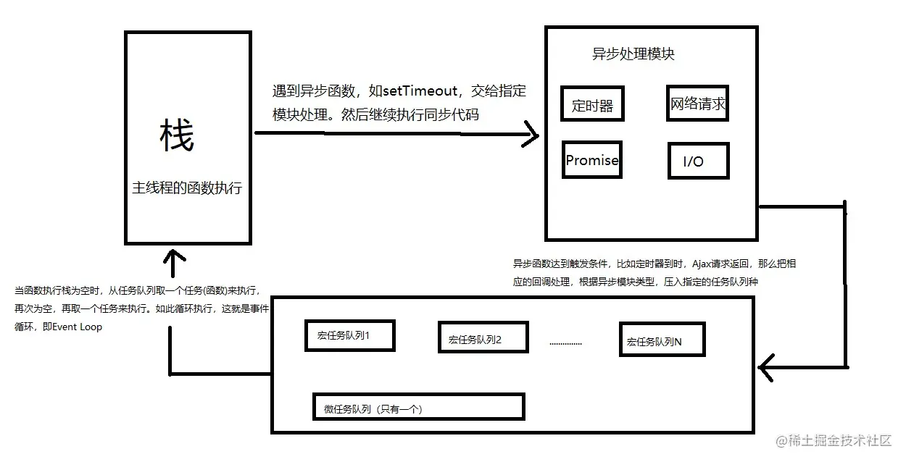

# 0. 事件循环

## 0.1 产生原因

- JS是一门单线程语言。单线程就意味着，所有的任务需要排队，前一个任务结束，才会执行下一个任务。
- 这样所导致的问题是：如果JS执行的时间过长，这样就会造成页面的渲染不连贯，导致页面渲染加载阻塞的觉。
  为了解决这个问题，JS中出现了同步和异步。

## 0.2 任务区别

同步任务：即主线程上的任务，按照顺序由上⾄下依次执⾏，当前⼀个任务执⾏完毕后，才能执⾏下⼀个任务。

异步任务：不进⼊主线程，⽽是进⼊任务队列的任务，
        执行完毕之后会产生一个回调函数(如ajax请求响应返回, setTimeout延迟到指定时间),并且通知主线程。
        当主线程上的任务执行完后，就会调取最早通知自己的回调函数，使其进入主线程中执行。

## 0.3 执行机制

- 1. 同步任务：会在主线程上执行，形成一个执行栈（call stack）。
- 2. 异步任务：进入异步处理模块并注册回调函数，等到指定的事件完成时，异步处理模块会将这个回调函数移入异步任务队列。

当执行栈中的代码执行完毕，执行栈中的任务为空时，开始执行异步任务队列

- 3. 微任务队列：优先检查微任务中是否有任务，如果有，就将微任务队列中的所有任务依次执行，直到微任务队列为空;
- 4. 宏任务队列：再检查宏任务队列中是否有任务，如果有，则取出第一个宏任务加入到执行栈中，之后再清空执行栈，检查微任务
     以此循环，直到全部的任务都执行完成。



## 0.4 任务举例

微任务：async/await, promise.then() ,  **`resolve` 或者 `reject` 函数**
宏任务：事件，ajax请求，setTimeout(), fs.readFile

1. promise本身是一个同步的代码，后面调用的then()方法里面的回调才是微任务
2. await右边的表达式还是会立即执行,表达式之后的代码才是微任务, await微任务可以转换成等价的promise微任务分析
3. script标签本身是一个宏任务， 当页面出现多个script标签的时候，浏览器会把script标签作为宏任务来解析

# 1. Promise

- Promise本质是一个类，或者可以称之为一个构造函数，因为它可以使用new 关键字来创建一个Promise对象；
  Promise的 `参数`是一个函数，该函数的参数又是两个函数，一般称之为resolve和reject；
- Promise是 `有状态的`，一旦状态确定，就不可被修改，
  默认状态为pending（初始状态），
  当我们调用参数中的resolve函数，内部状态会变为fulfilled（已完成），
  如果我们调用参数中的reject函数，内部状态会变为rejected（已拒绝）；
- Promise可以接收回调，我们可以通过.then来对Promise进行链式调用，
  .then也是一个函数，它可以接收两个参数（也都为函数），
  第一个参数是调用resolve产生的回调，
  第二个参数是调用reject产生的回调；

## 1.1）Promise的基本使用

```js
const p = new Promise((resolve, reject) => {})

console.log(p) // Promise {`<pending>`}

const p1 = new Promise((resolve, reject) => {

    resolve() // Promise {`<fulfilled>`: undefined}

})

console.log(p1)

const p2 = new Promise((resolve, reject) => {

    reject() // Promise {`<rejected>`: undefined}

})

console.log(p2)
```

由此可以看出Promise的三种状态；

## 1.2 回调.then 与.catch

```js
const p = new Promise((resolve, reject) => {
    resolve()
}).then(res => {
    console.log(res) // undefined
})

const p1 = new Promise((resolve, reject) => {
    reject()
}).then(null, err => {
    console.log(err) // undefined

})
```

通过.then方法的第一个参数，接收到了resolve的回调，并打印出了undefined；

通过.then方法的第二个参数，接收到了reject的回调，并打印出了undefined；

有人会认为Promise.then()只能接收一个参数，而reject的回调是在Promise.catch中接收的。如下：

```js
const p1 = new Promise((resolve, reject) => {
    resolve()
}).then(res => {
    console.log(res)
}).catch(err => {
    console.log(err)
})
```

这种方法也可以接收reject的回调，只是这种方法只是JavaScript帮助我们实现的一个语法糖而已，在PromiseA+规范中，是没有.catch这个说法的。

## 1.3 回调resolve(), reject()的传参

如果 resolve()或reject() 传入的参数

- 普通值（包括普通对象）： 那么会将该值原封不动的做为.then 中的参数被 resolve/reject 的回调接收。
- Promise 对象： 那么会将Promise 对象的结果做为.then 中的参数被 resolve/reject 的回调接收，如果有延时执行，.then 会等待传入的 Promise 有结果之后才会执行。
- thenable 对象：那么会将thenable 对象的 resolve 或 reject 的结果做为.then 中的参数被 resolve/reject 的回调接收，如果有延时执行，.then 会等待传入的 thenable 有结果之后才会执行。

(1)传递普通值

- 将普通值作为参数传给resolve或者reject，该参数会作为.then方法的第一个参数或第二个参数（都是函数）的参数传递过去。

```js
const p = new Promise((resolve, reject) => {
    resolve(1)
})

.then(res => {
    console.log(res) // 1
})
```

(2)传递Promise

- 当传递一个有状态的Promise作为resolve或reject的参数时，会等待该Promise的resolve或reject的结果，然后将该结果作为.then方法的第一个参数或第二个参数（都是函数）的参数传递过去。

```js
// 传递无状态的Promise

const innerP = new Promise(() => {})
const p = new Promise((resolve, reject) => {
    resolve(innerP)
}).then(res => {
    console.log(res) // 啥都没有
})

// 传递有状态的Promise

const innerP = new Promise(resolve => {
    setTimeout(() => {
    // resolve()
    resolve(1)
    }, 1000)
})

const p = new Promise((resolve, reject) => {

    resolve(innerP)

}).then(res => {

    // console.log(res) // 等待1s -> undefined

    console.log(res) // 等待1s -> 1

})
```

(3)传递一个普通对象

- 传递普通对象时，和传递普通值结果一样。

```js
const obj = {

    name: 'Lee'

}

const p = new Promise((resolve, reject) => {

    resolve(obj)

}).then(res => {

    console.log(res) // {name: 'Lee'}

})
```

(4) 传递一个thenable对象

- thenable对象指的就是一个对象，它拥有then方法，该方法拥有两个参数，且都为函数（第一个参数相对于resolve，第二个相当于reject），并且在then方法之中调用了这两个参数的其中一个。
- 传递一个thenable对象时，会将该thenable对象转换为Promise对象，效果和传递一个Promise对象相似。

```js
const obj = {

    name: 'Lee',

    then: function (resolve, reject) {

    resolve(this.name)

    }

}

const p = new Promise((resolve, reject) => {

    resolve(obj)

}).then(res => {

    console.log(res) // Lee

})
```

## 1.4 对象方法

### 1.4.1 then()

- then() 方法返回一个Promise。
- then() 方法可以多次调用。
- then() 方法可以链式调用，上次then的返回值会作为下次then方法中的参数。
- 它最多需要有两个参数：Promise 的成功和失败情况的回调函数。参数：onFulfilled 可选 onRejected 可选

```plain
onFulFilled 是当 Promise 变成接受状态（fulfilled）时调用的函数。该函数有一个参数，即接受的最终结果。如果该参数不是函数，则会在内部被替换为 (x) => x，即原样返回 promise 最终结果的函数。
onRejected 是当 Promise 变成拒绝状态（rejected）时调用的函数。该函数有一个参数，即拒绝的原因。 如果该参数不是函数，则会在内部被替换为一个 抛出器函数（(x) => { throw x; }）。
```

```js
const p = new Promise((resolve, reject) => {
    resolve(1)
})

p.then(res => {
    console.log(res) // 1
})

p.then(2).then(res => {
    console.log(res) // 1
})

const p1 = new Promise((resolve, reject) => {
    reject('err')
})

p1.then(undefined, err => {
    console.log(err) // err
})

p1.then(undefined, 'err2').then(undefined, err => {
    console.log(err) // err
})
```

上述代码中，当一个Promise调用多次then方法时，所有方法都会被调用，如果then的参数不是函数，会转换成x => x/x => throw x（x为Promise中resolve/reject的参数）的格式。

### 1.4.2 catch()

- catch() 方法返回一个 Promise
- 在 Promise 被拒绝之后，执行相应的回调。它的行为与调用 Promise.prototype.then(undefined, onRejected) 相同。
- 参数：onRejected

当 Promise 被拒绝时，被调用catch()方法。 该函数拥有一个参数reason来表示Promise 被拒绝的原因。
如果 onRejected 抛出一个错误或返回一个本身失败的 Promise，那么通过 catch() 返回的 Promise 就会被 rejected；
否则 它将显示为成功（resolved），这也就意味着，如果在onRejected 中继续抛出一个错误，可以在后续继续使用 catch()链式调用进行捕获。

```js
const p = new Promise((resolve, reject) => {
    reject(1)
})

p.catch(err => {
    console.log(err)
    throw 2
}).catch(err => {
    console.log(err)
})
```

### 1.4.3 finally()

- finally() 方法返回一个Promise。
- 在 promise 结束时，无论结果是 fulfilled 或者是 rejected，都会执行指定的回调函数。
- 这避免了同样的语句需要在 then()和 catch()中各写一次的情况。

参数：onFinally -> Promise 结束后调用的方法。

```js
const p = new Promise((resolve, reject) => {
    resolve(1)
})

p.then(res => {
    console.log(res)
}).finally(() => {
    console.log('end')
})

// 打印顺序 1 -> 'end'
```

## 1.5 静态方法

### 1.5.1 resolve/reject

- Promise.resolve(value): 创建一个解析为给定值的 Promise 对象。如果给定的值是一个 Promise，那么返回那个 Promise。
- Promise.reject(reason): 创建一个以给定原因拒绝的 Promise 对象。

```js
console.log(Promise.resolve(123)) // Promise {`<fulfilled>`: 123}
const promise = new Promise(resolve => resolve(123))
console.log(Promise.resolve(promise))
// Promise {`<fulfilled>`: 123}

const thenable = {
    then: (resolve, reject) => {
    resolve(123)
    }
}
console.log(Promise.resolve(thenable))
```

从上面代码可以得知，Promise.resolve()返回的是一个解析过的Promise，并且根据传入的值，返回不同的Promise。

```js
const thenable = {
    then: (resolve, reject) => {
    resolve({
    then: function (onFulfilled, onRejected) {
    onFulfilled(123)
    }
    })
    }
}

Promise.resolve(thenable).then(res => {
    console.log(res) // 123
})
```

上述代码证明了thenable中的then方法resolve/reject另一个thenable时，会被Promise.resolve连续处理，保证最终结果不是一个thenable；MDN上对此的说明

### 1.5.2 all

Promise.all(iterable): 接受一个可迭代对象，包含多个 Promise 实例。

- 只有当所有给定的 Promise 都成功时，返回的 Promise 才会解析，解析值是一个包含所有 Promise 解析值的数组。
- 如果任何一个 Promise 失败，返回的 Promise 就会以失败的 Promise 的失败原因拒绝。

```js
const p1 = new Promise(resolve => {

    resolve(1)

})

const p2 = 2

const p3 = new Promise((resolve, reject) => {

    reject(3)

})

Promise.all([p1, p2])

.then(res => {

  console.log(res) // [1, 2]

})

.catch(err => {

  console.log(err)

})

Promise.all([p1, p3])

.then(res => {

  // 不会执行

  console.log(res)

})

.catch(err => {

  console.log(err) // 3

})
```

### 1.5.3 race

Promise.race(iterable): 同样接受一个可迭代对象，包含多个 Promise 实例。

- 只要可迭代对象中的任何一个 Promise 解析或拒绝，返回的 Promise 就会立即解析或拒绝。

```js
const p1 = new Promise(resolve => {
    setTimeout(() => {
    resolve(1)
    }, 300)
})

const p2 = new Promise(resolve => {
    setTimeout(() => {
    resolve(2)
    }, 200)

})

const p3 = new Promise((resolve, reject) => {
    setTimeout(() => {
    resolve(3)
    }, 100)
})

Promise.race([p1, p2, p3])
.then(res => {
  console.log(res) // 3 因为100毫秒后p3先完成
})

.catch(err => {
  console.log(err)
})
```

### 1.5.4 any

Promise.any(iterable): 接受一个可迭代对象，包含多个 Promise 实例。

- 与 Promise.race 类似，只要可迭代对象中的任何一个 Promise 解析，返回的 Promise 就会解析。
- 如果所有的 Promise 都被拒绝，返回的 Promise 也会被拒绝，
- 拒绝的原因是一个 AggregateError 对象，包含所有失败的 Promise 的拒绝原因。

```js
const p1 = new Promise(resolve => {
    reject(1)
})

const p2 = new Promise(resolve => {
    resolve(2)
})

const p3 = new Promise((resolve, reject) => {
    resolve(3)
})

Promise.any([p1, p2, p3])
.then(res => {
  console.log(res) // 2
})

.catch(err => {
  console.log(err)
})

Promise.any([])
.then(res => {
  console.log(res)
})

.catch(err => {
  console.log(err) // AggregateError: All promises were rejected
})
```

### 1.5.5 allSettled

Promise.allSettled(iterable): 接受一个可迭代对象，包含多个 Promise 实例。

- 无论 Promises 成功还是失败，返回的 Promise 都会解析。
- 解析值是一个数组，每个数组元素对应传递给 allSettled 的 Promise，
- 且该数组包含两个属性：status（"fulfilled" 或 "rejected"）和 value 或 reason。

```js
const p = new Promise((resolve, reject) => resolve(1))

const p1 = new Promise((resolve, reject) => reject(2))

const p2 = new Promise((resolve, reject) => reject(3))

Promise.allSettled([p, p1, p2]).then(res => {

    console.log(res)

})

// output: [0: {status: 'fulfilled', value: 1} 1: {status: 'rejected', reason: 2} 2: {status: 'rejected', reason: 3}]
```

### 1.5.6 withResolvers

Promise.withResolvers()用于返回一个对象，其包含一个新的Promise对象和两个函数，用于解决或拒绝它，这两个函数对应于Promise对象中的resolve和reject。

它和普通创建Promise对象唯一不同的区别就是，这种方法创建的Promise对象，Promise本身和resolve、reject函数处于同一作用域，而不是被一次性使用。

```js
const p = Promise.withResolvers()

console.log(p) // {promise: Promise{`<fulfilled>`: 1}, reject: f(), resolve: ()}

p.resolve(1)

p.promise.then(res => {

    console.log(res) // 1

})
```

## 1.6 Promise.resolve和new Promise(resolve =>)的区别

Promise.resolve() 和 new Promise((resolve, reject) => {...}) 都是创建 Promise 对象的方法

但它们在用法和用途上有一些区别：

### 1.6.1 简洁性:

- Promise.resolve(value) 是一种更简洁的创建已解析 Promise 的方式。它接受一个参数，该参数可以是任何类型的值，Promise 会立即解析为这个值。
- new Promise((resolve, reject) => {...}) 创建一个新的 Promise 实例，你需要手动调用 resolve 函数来解析它。这种方式更灵活，但代码更冗长。

### 1.6.2 立即解析 vs 延迟解析:

- 使用 Promise.resolve(value) 创建的 Promise 会立即解析，不需要等待任何异步操作完成。
- 使用 new Promise(...) 创建的 Promise 则是延迟解析的，它需要在某个时间点（通常是异步操作完成后）手动调用 resolve 或 reject 来解析或拒绝。

### 1.6.3 参数类型:

- Promise.resolve(value) 可以接受任何类型的参数，如果参数本身是一个 Promise，那么 resolve 会返回这个 Promise，这被称为“Promise 的传递性”。
- new Promise((resolve, reject) => {...}) 的参数是一个执行函数，这个函数有两个参数 resolve 和 reject，分别用于解析和拒绝 Promise。

### 1.6.4 用途:

- Promise.resolve(value) 通常用于将同步值或已经解析的 Promise 值转换为一个新的 Promise 对象，或者在 Promise 链中作为返回值。
- new Promise((resolve, reject) => {...}) 通常用于需要显式控制 Promise 解析时机的场景，比如封装异步操作或者需要在某个条件满足后才解析 Promise。

### 1.6.5 错误处理:

- Promise.resolve(value) 不涉及错误处理，因为它创建的 Promise 总是立即解析的。
- new Promise((resolve, reject) => {...}) 允许你通过 reject 函数来处理错误情况，提供了更详细的错误处理机制。

## 1.7 Promise是为了解决什么

- Promise主要用于解决回调地狱问题
- 在Promise出现之前，想要处理异步任务只能通过定时器等方式，并且不支持链式调用，导致各种回调，代码杂乱、错误异常不容易捕获等问题
- 但是Promise本身在回调过多的情况下，也会产生很多.then链式调用的代码，只是相对于之前的方式来说好了一些，但并不是最优。

# 2. async/await

async/await是ES8（ES2017）出现的一个异步调用的语法糖；

async/await的原理是Promise和generator（生成器）；

## 2.1 async

- async用于声明一个异步函数，是单词（asynchronous）的缩写；
- async声明的函数的返回值，会隐式包裹一层Promise对象；
- async声明的函数如果返回一个普通值，会得到一个fulfilled状态的 Promise。.then 的结果是这个值本身；
- async声明的函数如果返回一个thenable对象或Promise，会得到一个pending状态的 Promise。.then 的结果是thenable或Promise对象的结果；

## 2.2 await

- await表示的是等待 ，等待的是右侧的表达式结果；
- await关键字只能在带有async关键字的函数内部使用，在外部使用时会报错；
- await的格式[返回值] = await 表达式；
- await后面的表达式可以是一个Promise对象或任何要等待的值；
- await后面如果跟的是一个Promise，并且该 Promise 的状态是fulfilled,则返回值是这个Promiseresolve 的值，如果该 Promise 的状态是rejected，则会抛出异常。如果是一个thenable对象，那么返回值是 thenable 最终的状态。如果是普通值，那么返回值是表达式本身的值。
- await会暂停当前异步函数的运行，直到右侧表达式执行完毕，在异步函数中，await 语句下面的代码会被放入异步队列中；
- await右侧表达式的的执行不受 await 影响；
- await在最新的ES标准中和Promise.resolve()语义一致。

当使用async/await对多个函数进行顺序调用时我们可以这么写：

```js
  async function result() {

    const res = await fun()

    const res1 = await fun1()

    const res2 = await fun2()

  }
```

这种格式很像我们的生成器函数，而async/await的原理就是生成器+promise。

await右侧的代码会同步执行，因为await的语义和Promise.resolve()一致；

```js
function baseFun() {

    return 1

}

async function myFun() {

    await baseFun()

    // 等同于

    Promise.resolve(baseFun())

}
```

await语句下面的代码会被加入异步队列，异步执行，可以理解为，await下面的代码等同于Promise.resolve().then()中的代码。

```js
function baseFun() {

    return 1

}

async function myFun() {

    await baseFun()

    console.log('异步执行')

    // 等同于

    Promise.resolve(baseFun()).then(() => {

    console.log('异步执行')

    })

}
```

很多人说async/await写出的代码是同步代码，其实这种说法是完全错误的，async/await代码本质上还是异步代码，只不过有了暂停的概念，让后续的同步代码等待异步代码的执行，看起来像是同步代码而已。

## 2.3 捕获async/await的异常

如果await后面的语句抛出了异常，我们可以通过try...catch来捕获。

```js
function baseFun() {
    throw new Error('错误~')
}

async function myFun() {
    try {
    await baseFun()
    } catch (err) {
    console.log(err) // Error: 错误~
    }
}

myFun()
```

## 2.4 async/await解决了什么问题

- Promise和生成器函数解决了一部分的回调地狱问题，但是碰见复杂场景时，还是略有不足。
- async/await的出现，让我们在解决复杂的异步回调问题时，代码能够更加的优雅
- 面对错误处理时，可以结合try...catch完美的捕获异常，总的来说，它能够让我们的代码在处理异步问题时更加的清晰明了，书写更加规范整齐，增强阅读性。
