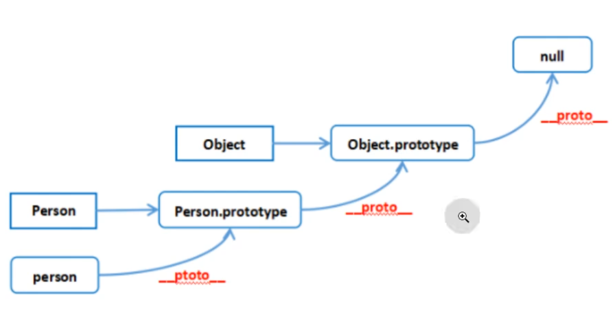

# 1. 深拷贝与浅拷贝
  1. 赋值
    当我们把一个对象赋值给一个新的变量时，
    赋的其实是该对象的在栈中的地址,而不是堆中的数据。
      也就是两个对象指向的是同一个存储空间，
      [无论哪个对象发生改变，其实都是改变的存储空间的内容]，

  2. 浅拷贝
    浅拷贝是按位拷贝对象，
    它会创建一个新对象，这个对象有着原始对象属性值的一份精确拷贝。
      如果属性是基本类型，拷贝的就是基本类型的值；
      如果属性是内存地址（引用类型），拷贝的就是内存地址 .
    因此[如果其中一个对象改变了这个地址，就会影响到另一个对象]。
    即默认拷贝构造函数只是对【对象】进行浅拷贝复制，
    也就是说只复制对象空间而不复制资源

## 实现浅拷贝
```javascript
//1. 展开运算符... 实现浅拷贝
let obj1 = {
    name: 'Chen',
    hobby: ['see a film', 'write the code', 'play basketball', 'tourism']
}

let obj2 = {...obj1};
obj2.hobby[1] = 'swim';
obj2.hobby[2] = 'alpinism';
obj2.name = 'Forever';
console.log('obj1===>', obj1); // obj1===> { name: 'Chen',hobby: [ 'see a film', 'swim','alpinism', 'tourism']}
console.log('obj2===>', obj2); // obj2===> { name: 'Forever',hobby: [ 'see a film', 'swim','alpinism', 'tourism']}

//2. Object.assign() 实现浅拷贝
let obj1 = {
  name: "Chen",
  hobby: ["see a film", "write the code", "play basketball", "tourism"],
};

let obj2 = Object.assign({}, obj1);
obj2.hobby[1] = "swim";
obj2.hobby[2] = "alpinism";
obj2.name = "Forever";
console.log("obj1===>", obj1); // obj1===> {name: 'Chen',hobby: [ 'see a film', 'swim', 'alpinism', 'tourism' ]}
console.log("obj2===>", obj2); // obj2===> {name: 'Forever',hobby: [ 'see a film', 'swim', 'alpinism', 'tourism' ]}

//3. Array.prototype.concat() 实现浅拷贝
let arr1 =  [
    {
        name: 'Chen'
    },
    'see a film', 
    'write the code', 
    'play basketball', 
    'tourism'
];
let arr2 = arr1.concat([]);
arr2[0].name = 'Forever';
arr2[1] = 'play games';
console.log('arr1===>', arr1); // arr1===> [{ name: 'Forever' },'see a film','write the code','play basketball', 'tourism']
console.log('arr2===>', arr2); // arr2===> [{ name: 'Forever' },'play games','write the code', 'play basketball', 'tourism']

//4. Array.prototype.concat() 实现浅拷贝
let arr1 =  [
    {
        name: 'Chen'
    },
    'see a film', 
    'write the code', 
    'play basketball', 
    'tourism'
];
let arr2 = arr1.slice();
arr2[0].name = 'Forever';
arr2[1] = 'play games';
console.log('arr1===>', arr1); // arr1===> [{ name: 'Forever' },'see a film','write the code','play basketball', 'tourism']
console.log('arr2===>', arr2); // arr2===> [{ name: 'Forever' },'play games','write the code', 'play basketball', 'tourism']

```

  3. 深拷贝: 
    深拷贝是将一个对象从内存中完整的拷贝一份出来,
    从堆内存中开辟一个新的区域存放新对象（新旧对象不共享同一块内存）,
    并且[修改新对象不会影响原对象]
    深拷贝采用了在堆内存中申请新的空间来存储数据，这样每个可以避免指针悬挂
## 实现深拷贝：
   JSON.parse(JSON.stringify(obj))
  这个方法可以将一个【对象】序列化为 【JSON 字符串】，
  然后再将 【JSON 字符串】解析为一个新的【对象】.

  因为它曾转化为字符串，
  所以不会出现像浅拷贝中那种引用类型指向同一地址的情况，从而实现深拷贝。

```javascript
//  JSON.parse(JSON.stringify())实现深拷贝Object
let obj1 = {
    name: 'Chen',
    hobby: ['see a film', 'write the code', 'play basketball', 'tourism']
}
let obj2 = JSON.parse(JSON.stringify(obj1));
console.log(obj1 === obj2); // false
obj2.name = 'Forever';
obj2.hobby[1] = 'swim';
obj2.hobby[2] = 'alpinism';

console.log('obj1===>', obj1); // obj1===> { name: 'Chen',hobby: ['see a film', 'write the code', 'play basketball', 'tourism']}
console.log('obj2===>', obj2); // obj2===> { name: 'Forever',hobby: ['see a film', 'swim', 'alpinism', 'tourism']}
--------------------------------------------------
function isObject(val) {
  return typeof val === "object" && val !== null;
}

function deepClone(obj, hash = new WeakMap()) {
  if (!isObject(obj)) return obj;
  if (hash.has(obj)) {
    return hash.get(obj);
  }
  let target = Array.isArray(obj) ? [] : {};
  hash.set(obj, target);
  Reflect.ownKeys(obj).forEach((item) => {
    if (isObject(obj[item])) {
      target[item] = deepClone(obj[item], hash);
    } else {
      target[item] = obj[item];
    }
  });

  return target;
}

// var obj1 = {
// a:1,
// b:{a:2}
// };
// var obj2 = deepClone(obj1);
// console.log(obj1);

```


# 2. 箭头函数 =>
      1. 不能作为构造函数使用
      2. 不能用new
      3. 箭头函数没有 原型
      4. 箭头函数没有 arguments
      5. 箭头函数不能用 call, apply, bind 去改变this的执行
      6. this指向外层第一个函数的this

# 3. 事件循环EventLoop
  JS是单线程的，为防止代码阻塞，把代码分为同步任务与异步任务
1. 执行栈
      { 同步任务， 任务队列{ 宏任务与微任务 } }
2. 任务队列（异步任务）
   将【异步任务】放入任务队列【排队】
    宏任务： settimeout、setinterval、script代码
    微任务： promise.then  async/await  process.nextTick()
    [微任务先于宏任务执行] 
3. 事件循环概念
    1. 【执行栈】先执行【同步任务】
    2. 执行过程中，当遇到异步任务时，将其回调函数加入消息队列。
    3. 执行栈执行完毕 为空后， 检查【任务队列】是否有【异步任务】
    4. 如果任务队列中有任务，就将任务的回调函数推入执行栈执行
    5. 反复循环执行

# 4. Vue 的 $nextTick 原理及作用
  - 原理：
      是对 JavaScript 执行原理 EventLoop 的一种应用。
      是 Vue.js 中一个重要的异步更新机制，它用于在 DOM 更新之后执行回调函数。确保在数据变化后，DOM 已经更新。
  - 实现
    Vue 使用 Promise 或 MutationObserver 来模拟微任务。
    如果两者都不可用，Vue 会回退到使用 setTimeout 来模拟宏任务。
    当数据发生变化时，Vue 异步执行 DOM 更新。
    在这个过程中，Vue 会将需要执行的异步回调函数推入一个队列中，
    而不是立即执行它们


# 5. 闭包
- 概念：
  函数执行后返回结果是一个内部函数，并被外部变量所引用，
  如果内部函数持有被执行函数作用域的变量，即形成了闭包。
- 特点： 
    1. 可以重复利用变量
    2. 变量不会污染全局
    3. 变量保存在内存中
    4. 不会被垃圾回收机制回收
- 缺点：
    闭包较多的时候，消耗内存
    导致页面性能下降
- 使用场景
    防抖，节流，嵌套函数避免全局污染的时候


# 6. 内存泄漏
- 现象
    js中已经分配内存地址对象
    但是， 由于长时间未释放，或者 无法清除， 
- 后果
    造成长时间占用内存， 让内存资源大幅浪费
    最终使得运行速度慢， 甚至崩溃
- 产生因素
    为声明直接赋值的变量
    未清空的定时器
    过度的闭包
    未清除的引用元素

# 7. 事件委托（事件代理）
- 原理
    将事件监听器添加到父元素，而不是每个子元素单独设置事件监听器。
    当触发子元素时，事件会冒泡到父元素，监听器就会触发。
- 好处： 
  1. 内存占用减少，因为只需要一个父元素的事件处理程序，而不必为每个后代都添加事件处理程序。
  2. 无需从已删除的元素中解绑处理程序，也无需将处理程序绑定到新元素上。
  3. 性能优化

- 实现
    组织事件冒泡： event.stopPropagation()
    addEventListener('click', function, true/false)
    默认false ( 事件冒泡 )， true（事件捕获）


# 9. 原型链
## 9.1 原型概念
    每个【函数】有【prototype属性】： 即原型。原型的值是一个对象
    这个对象是调用该constructor构造函数所创建的实例的原型。
## 9.2 原型链概念 

    每一个【对象】都有【__proto__属性】，用于指向原型对象。
    原型对象也有__proto__属性，指向原型对象的原型对象，直至最顶层 null为止，这样一层一层形成链式结构，也就是原型链

## 9.3 原型的作用：
    1. 为构造函数的实例 共享 属性和方法
    2. 可以把方法挂载在原型上， 内存只会保存一份


# 11 Promise
  ## 11.1 promise介绍
    1.  promise是一个对象，从它可以获取异步操作的消息；获取成功的结果  then ，获取失败的结果  catch 指定reject的回调
    2. 自身有all, reject, resolve, race
  ## 11.2. promise原理
        1. let p = new Promise((resolve, reject) => {
            //做一些异步操作
            setTimeout(() => {
              console.log('执行完成');
              resolve('我是成功！！');
              }, 2000);
           });
            【注】 resolve和reject是改变promise的参数
        2. .then()方法， 指定状态改变时的操作， 
            第一个回调函数 处理fulfilled状态时 的结果
            第二个回调函数 处理rejected状态时 的原因
        3. all方法提供了并行执行多个异步操作的能力，并且在所有异步操作执行完后才执行回调。
    
  ## 11.3. promise缺点： 
        1. 一旦处于 fulfilled 或者 rejected 状态，状态就会凝固， 不可取消
        2. 无法直接获取进展
        3. 如果异步任务较多，同时他们之间有依赖关系
            就只能用回调函数处理，容易形成链式调用嵌套
            代码可读性差， 可维护性差

  ## 11.4. promise状态
        三种状态
            pending: 等待状态
            fulfilled: 成功
            rejecteed: 失败
        状态变化：
            pending -> fulfilled;
            pending -> rejected
# 12 async/await
  ## 1.  async 、await 与 promise
    共同点： 都是处理【异步请求】的方式
    区别： 
        1. async await是基于promise实现的 
        2. promise 返回对象用then, catch 方法处理和捕获异常 ( 书写方式是链式， 容易造成代码堆叠 )
           await async 是通过try catch进行异常捕获
        3. async await 遇到await就立刻返回结果， 在执行后面的操作
            promise.then（） 会出现请求还没返回， 就执行了后面的操作
  ## 2.  async 与 await的区别
        他俩同步代码做异步操作， 两者必须搭配使用
        async表明函数内有异步操作
          调用函数会返回promise
        await是组成async的表达式
          结果取决于它等待的内容
            如果是promise,  就进行 promise
            如果是普通函数， 就进行 链式调用

  ## 3. async与defer的区别
    没有async 与 defer 时
      会立刻加载并执行指定的脚本
    有async 
      加载和渲染后面的元素的过程将和script的 加载和执行 并行进行（异步）
    有defer
      加载和渲染后面的元素过程将和script的加载 并行执行（异步）
      但是执行要等所有元素解析完成后才会执行
      能保证脚本执行顺序

# 13. this的指向问题
  - 1. 默认绑定:
                非严格模式下 this 指向【全局对象】，
                严格模式： this 会绑定为【 undefined 】
  - 2. 隐式绑定: 
                满足 XXX.fn() 格式，fn 的 this 指向 XXX。
                如果存在链式调用， this 永远指向最后调用它的那个对象 
                隐式绑定丢失：起函数别名，通过别名 运行， 函数作为参数会造成隐式绑定丢失。
    3. 显式绑定: 通过 call/apply/bind 修改 this 指向
    4. new绑定: 
            通过 new 来调用构造函数，会生成一个新对象，并且把这个新对象绑定为调用函数的 this 。
    5. 箭头函数绑定: 
        箭头函数没有 this ，它的 this 是通过作用域链查到外层作用域的 this ，且指向函数定义时的 this 而非执行时

# 14  new操作符的创建步骤
      1. 创建一个空的简单对象（即 {} ）；
      2. 为对象添加属性 proto ，将该属性链接至构造函数的原型对象 ；
      3. 将对象作为 this 的上下文 ；
      4. 如果该函数没有返回对象，则返回 this 。

# 15  call， apply， bind三者的区别 
      - 共同点：  修改this 的指向 和 函数的调用
      - 不同
          call和apply 功能类似， 只是传参不同
          1. call()  第一个参数是对象，           后续所有参数就是传入该函数的值
          2. apply() 只有两个参数，第一个是对象，第二个是数组（就是函数的参数）
          3. bind（） 参数和call() 相同 
                      传参后不会立刻执行， 
                      会返回一个改变 this指向 而得到的函数


