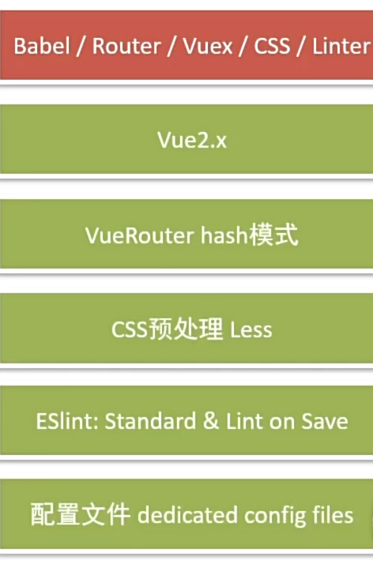
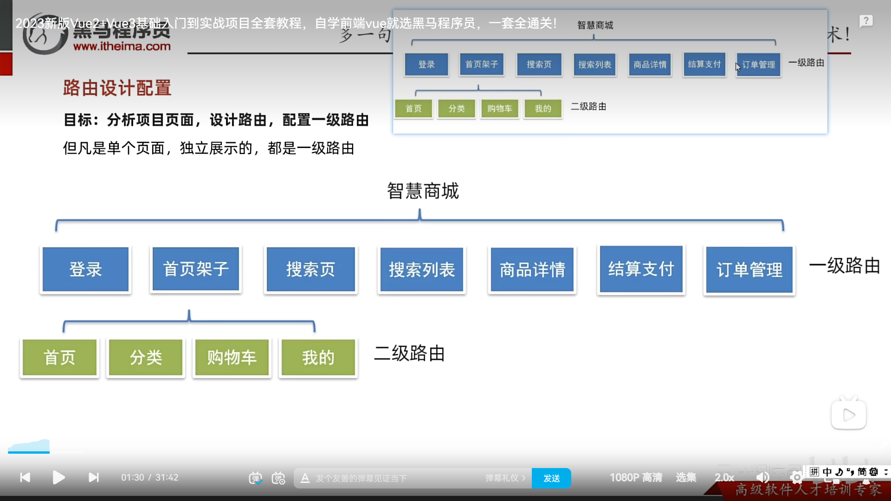

# 0. 脚手架配置


# 1. 组件库导入
见08-vant组件库

# 2. 全局样式
在styles/common.less文件下放置

# 3. 路由配置

1. 在views文件夹下建立一二级文件夹
2. 配置一二级路由
```
const router = new VueRouter({
  routes: [
    {
      path: '/',
      component: Layout,
      redirect: '/home',
      children: [
        { path: '/home', component: Home },
        { path: '/category', component: Category },
        { path: '/cart', component: Cart },
        { path: '/user', component: User }
      ]
    },
    { path: '/login', component: Login },
  ]
})

```
# 4. axois配置
## 在utils文件夹下建立request.js文件
1. 建立实例 - 避免污染原始实例
```
const instance = axios.create({
  baseURL: 'http://cba.itlike.com/public/index.php?s=/api/',
  timeout: 5000
})
```
2. 请求拦截器
禁止背景点击 - 节流处理 - 防止多次请求
Toast.loading {
  forbidClick: true, 
} 

3. 响应拦截器
默认axios会多包装一层data
  const res = response.data 


# 5. api接口模块
## 新建api/login.js文件
```
import request from '@/utils/request'

export const getPicCode = () => {
  return request.get('/captcha/image')
}

```

# 6. vuex模块--共享数据
## 新建store/modules/user.js
```
export default {
  namespaced: true,
  state () {
    return {
      // 个人权证相关
      userInfo: getInfo()
    }
  },
  mutations: {
    setUserInfo (state, obj) {
      state.userInfo = obj
      setInfo(obj)
    }
  },
}

```

# 7. storage配置 -- 存储模块
## 在utils/storage.js文件夹下
1. 约定一个通用的键名 - 防止名字重复
2. 使用localStorage存储
3. 避免刷新页面导致数据丢失


# 8. 页面访问拦截
1. 路由导航守卫 - 全局前置守卫
2. 路由一旦匹配到， 就经过全局前置守卫
3. 只有前置守卫放行，才能解析渲染组件， 才能进入页面
4. 放行关键 -> 是否有登陆权证

```
// 全局前置导航守卫
const authUrls = ['/pay', '/myorder']
router.beforeEach((to, from, next) => {
  // 不需要登陆权证
  if (!authUrls.includes(to.path)) {
    next() // 所有的页面都直接放行
    return
  }
  // 需要登陆权证
  const token = store.getters.token
  if (token) {
    next() // token正确， 放行
  } else {
    next('/login') // token不正确， 让用户登录
  }
})
```


# 9 打包： npm run build
## 0. 目的：vue脚手架不参与上线
## 1. 在vue.config.js中， 配置成publicPath相对路径
```
const { defineConfig } = require('@vue/cli-service')
module.exports = defineConfig({
  publicPath: './',
  transpileDependencies: true
})

```

## 2. 路由懒加载： 不同路由对应组件分割
按需异步组件加载（不常用的路由组件）
```
// 一级路由
const Login = () => import('@/views/login')
const Search = () => import('@/views/search')
const SearchList = () => import('@/views/search/list')
const ProDetail = () => import('@/views/prodetail')
const Pay = () => import('@/views/pay')
const MyOrder = () => import('@/views/myorder')

```

