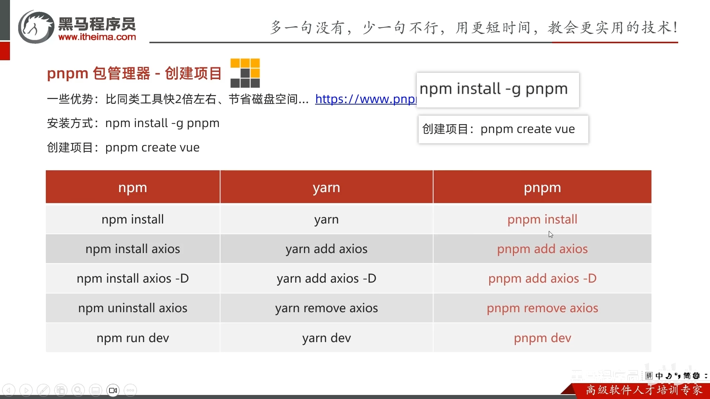

# 1. pnpm： 包管理器

1. 下载pnpm: npm install -g pnpm
2. 创建项目： pnpm create vue
3. 安装软件包: pnpm install


# 2. Eslint: 代码格式规范
## 2.1 Eslint：代码规范 -> 校验错误
## 2.2 prettier：  美观 -> 格式化


# 3. husky: 提交前做代码检查（避免提交后，出现错误）
1. 初始化git仓库： git init
2. 配置husky工具: pnpm dlx husky-init && pnpm install
3. 更改 .husky/pre_commit文件
    npm test => pnpm lint
4. 校验：git终端输入： pnpm lint


# 4. 暂存区eslint校验（保证自己写的代码不出错）
1. 安装包： pnpm i lint-staged -D
2. 配置package.json命令: 添加代码
```
// script添加
    "lint-staged": "lint-staged"
——————————————————————————————————    
  "lint-staged": {
    "*.{js,ts,vue}": [
      "eslint --fix"
    ]
  }
```
3. 修改.husky/pre_commit文件
    pnpm lint => pnpm lint-staged


# 5. 路由：vue-router 4.x
## 5.1 配置路由
1. history模式：createWebHistory
2. hash模式：createWebHash
```
import { createRouter, createWebHistory } from 'vue-router'

const router = createRouter({
  history: createWebHistory(import.meta.env.BASE_URL),
  routes: []
})

export default router

```

## 5.2 组件使用路由
1. 模板使用
<button @click="$router.push('/home')"></button>

2. 脚本使用
import { useRoute, useRouter } from 'vue-router'
const router = useRouter()
const route = useRoute()

const goList = () => {
  router.push('/list')
}


## 5.3 vite环境变量： (在vite.config.js中)
1. 配置基地址URL：import.meta.env.BASE_URL
2. 是否生产环境：import.meta.env.PROD
3. 是否开发环境：import.meta.env.DEV
4. 是否运行在server：import.meta.env.SSR


# 6. pinia： 状态管理器仓库
## 6.1 main.js引入使用:
```
  import pinia from '@/stores/index'
  app.use(pinia)
```

## 6.2 pinia持久化处理
安装： pnpm add pinia-plugin-persistedstate -D
```
import { createPinia } from 'pinia'
import persist from 'pinia-plugin-persistedstate'

const pinia = createPinia()
pinia.use(persist)

export default pinia
```

## 6.3 模块化管理 (在store/modules/user.js下) 
1. 模块内配置
```
import { defineStore } from 'pinia'
export const useUserStore = defineStore('big-user', () => {})
```

2. 导出模块（store/inedx.js中）
```
export * from './modules/user'
export * from './modules/counter'
```

# 7. api：数据交互与请求工具

# 8. chatpt: 人工智能

# 9. copilot: 智能生成代码
